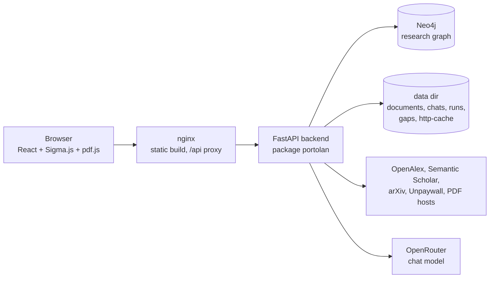
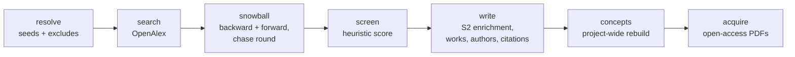
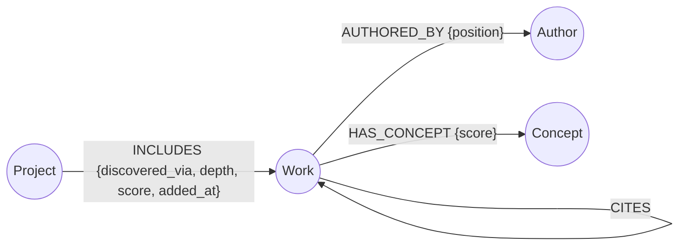

# Portolan architecture

This document describes how the code is put together as of M7. The decisions behind it are
recorded in the [ADRs](decisions/README.md); this page links to them rather than repeating
them. For using the UI, see the [user guide](user-guide.md).

## Components



`compose.yaml` runs three services. `frontend` is nginx serving the Vite build and proxying
`/api/` to the backend without buffering, so server-sent events stream. `backend` runs
`portolan serve`, and its data directory is the `portolan-data` volume at `/data`. `neo4j` is
Neo4j Community with its own volume. All ports bind to localhost. The backend waits for Neo4j's
healthcheck, creates the schema on startup (retrying while Neo4j comes up), and seeds the golden
demo project into an empty database when `PORTOLAN_SEED_GOLDEN` is true.

Configuration comes from environment variables, read once into `portolan.settings.Settings`.
The graph backend is chosen with `PORTOLAN_STORE=neo4j|memory`.

## Backend packages

| Package | Role |
|---|---|
| `api/` | FastAPI app (`app.py`), request/response models, run registry (`runs.py`), chat router (`chat.py`), frontier/gap router (`insights.py`). |
| `research/` | The harvest pipeline: `ResearchRunner`, `HeuristicScreener`, `ResearchSources` (adapter facade). Plain Python, no LLM (ADR-0007). |
| `adapters/` | HTTP clients for OpenAlex, Semantic Scholar, arXiv, Unpaywall and Crossref, with a file-based response cache under `http-cache/` and an offline mode for tests and evaluation. |
| `graph/` | The `ResearchGraph` interface, `Neo4jResearchGraph`, `InMemoryResearchGraph`, and the v1 graph models. |
| `concepts/` | Keyword grounding, keyphrase extraction, merging, and the noise filter (ADR-0008). |
| `documents/` | `DocumentStore` (content-addressed PDFs), text extraction with page markers, outlines, the `find_passage` quote matcher, and `PdfFetcher`. |
| `analysis/` | Clusters, centrality and roles, main path, frontier scores, gap detection, and `GapStore`. |
| `agent/` | Ask and Research agents (Deep Agents), graph and research tools, citation verification, `ChatStore`. |
| `cli.py` | The `portolan` Typer app (see the README). |
| `store/`, `models.py`, `iri.py` | The M0 RDF/LPG spike layer, kept for the parity and ontology tests. The app does not use it. |

## HTTP API

The app sits behind a lock-guarded proxy of the graph, so research worker threads and request
handlers can share one graph object (this matters for the in-memory backend).

| Area | Endpoints |
|---|---|
| Health, projects | `GET /api/health`; `GET/POST /api/projects`; `GET/DELETE /api/projects/{id}` (details include `ProjectStats`) |
| Graph, search, works | `GET /api/projects/{id}/graph?authors=&concepts=` (a `GraphView` of nodes and edges); `GET /api/projects/{id}/search?q=&limit=` (full-text search on title and abstract); `GET /api/works/{work_id}?project=` (neighbourhood: cites, cited by, authors, concepts) |
| Analysis | `GET /api/projects/{id}/analysis` (clusters, per-work PageRank, betweenness and roles, main path) |
| Insights | `GET /api/projects/{id}/frontier?window_years=2`; `GET /api/projects/{id}/gaps?include_rejected=`; `PATCH /api/projects/{id}/gaps/{gap_id}` (status, note); `POST /api/projects/{id}/gaps/{gap_id}/verify` |
| Runs | `POST/GET /api/projects/{id}/runs`; `GET /api/runs/{run_id}`; `POST /api/runs/{run_id}/cancel` |
| Documents | `GET /api/documents/{sha256}/pdf`, `/text`, `/outline`, `/locate?q=&page=` (find a quote and return page, offset and snippet), `/pages?start=&end=` (at most 10 pages of text) |
| Chat | `GET /api/chat/status`; `GET/POST /api/projects/{id}/chats`; `GET/DELETE /api/chats/{thread_id}?project=`; `POST /api/chats/{thread_id}/messages?project=` (SSE); `POST /api/chats/{thread_id}/resume?project=` (SSE, plan decision) |

The chat endpoints stream `status`, `answer`, `plan`, `error` and `done` events. Both chat
modes return 503 when `OPENROUTER_API_KEY` is unset. A thread takes one active answer at a time
and refuses new messages while a plan is pending (409).

## Research pipeline



`ResearchRunner.run(project_id, ResearchRequest, progress=, cancel=)` goes through these stages
and emits a `RunProgress` event per stage. It checks for cancellation between steps.

- **resolve**: seeds (DOI, arXiv, OpenAlex, or a Semantic Scholar id as fallback) are resolved
  through OpenAlex in batches. Unresolved seeds fall back to Semantic Scholar metadata and an
  OpenAlex DOI or title lookup. `exclude` identifiers are
  resolved as well and kept out of the pool. The recall evaluation uses this to leave out the
  survey itself. Neither the HTTP API nor the CLI exposes `exclude`.
- **search**: OpenAlex search with an optional year range. The top `core_search_hits` (10) hits
  join the seeds in the *core set*.
- **snowball**: depth 1 expands the core set backward (references) and forward
  (`forward_per_work` citing works each). Depth 2 screens the pool once and chases the
  references of the `chase_top` (20) best non-seed candidates. The pool is capped at
  `5 × max_works`.
- **screen**: `HeuristicScreener` weighs query/seed token overlap (0.45), links to seeds and
  included works (0.2), co-citation by the core set (0.25) and citation count (0.10). Seeds are
  always included. Other candidates are picked greedily until `max_works` is reached or the best
  remaining score is below `min_score` (0.15).
- **write**: Semantic Scholar enrichment, then `Work` upserts (identity is merged by DOI, arXiv,
  OpenAlex or S2 id), `INCLUDES` edges with `discovered_via`, `depth` and `score`, authors, and
  citations among included works.
- **concepts**: `rebuild_project_concepts` rebuilds the concepts of the **whole project**, not
  just the new works (see the concept pipeline below).
- **acquire**: seeds first, then in score order, up to `max_pdfs`. Candidate URLs come from
  OpenAlex, arXiv, Semantic Scholar and (with a contact email) Unpaywall. `PdfFetcher` rate-limits per host (5 s for arXiv), rejects
  landing pages and oversized files, and stores the result in the `DocumentStore`.

The API form (`ResearchRunRequest`) exposes `seeds`, `query`, `max_works`, `snowball_depth`,
`forward_per_work`, `from_year`, `to_year`, `acquire_pdfs`, `max_pdfs` and `keyword_min_score`.
The other pipeline fields keep their defaults.

**Run registry** (`api/runs.py`). Runs execute in a thread pool of
`PORTOLAN_MAX_CONCURRENT_RUNS` workers, with at most one queued or running run per project.
Every state change is written atomically to `runs/<project_id>/<run_id>.json` (progress writes
at most every 2 s), and the newest 50 runs per project are kept. On startup, runs left queued or
running are marked failed with `interrupted by a backend restart`. When a run succeeds, the
registry compares the project's work ids before and after and adds `works_before`,
`works_after`, `works_added` and up to 200 `added_work_ids` to the report. The UI's
"+N new works" line comes from these fields.

## Concept pipeline

Per ADR-0008, `rebuild_project_concepts_with_report` works like this:

1. Each OpenAlex keyword on a work is checked against that work's title and abstract
   (`concepts/grounding.py`). Unsupported keywords are dropped. On works with no abstract they
   are kept at half score.
2. Keyphrases of 1–3 words are extracted from all titles and abstracts in the project
   (`concepts/keyphrases.py`) and kept when at least two works use them.
3. Both kinds of occurrence are merged into concept clusters with normalisation and acronym
   linking (`concepts/merge.py`, no embedder). They then pass the noise filter
   (`concepts/filter.py`), which drops generic umbrella terms, terms on more than half of the
   works, and single-work terms.
4. `Concept` nodes are upserted, and every work's `HAS_CONCEPT` edges are replaced, which clears
   stale ones.

`portolan project rebuild-concepts` runs the same function for an existing project.

## Graph schema (Neo4j)

Defined by ADR-0006 and amended by ADR-0008 (where concepts come from).



- `Work`: `id`, `title`, `year`, `abstract`, `doi`, `arxiv_id`, `openalex_id`, `s2_id`,
  `venue`, `work_type`, `source_tier`, `cited_by_count`, `keywords` and `keyword_scores` (raw
  source keywords, the input to grounding), `document_sha256` and `document_source_url`.
- `Author`: `id`, `name`, `orcid`, `openalex_id`, `s2_id`. `Concept`: `id`, `label`, `aliases`.
- Uniqueness constraints cover the ids and external identifiers of works and authors. The
  full-text indexes are `work_text` (title and abstract) and `concept_text` (label).
- Works, authors and concepts are global. A project is the set of works it `INCLUDES`.
  Deleting a project removes the `Project` node and its edges only.

Clusters, frontier scores and gaps are **not** stored in the graph. They are computed on read.

## Document store

`DocumentStore` (under `documents/` in the data dir) is content-addressed by SHA-256:

```
documents/<sha[:2]>/<sha>/
  paper.pdf      the downloaded PDF
  paper.txt      extracted text, one "=== page N ===" marker per page
  meta.json      source URL, source, version, licence, pages, bytes, retrieved_at, text_status
  outline.json   section outline (from the PDF outline or detected headings), built lazily
```

A `Work` points at its document through `document_sha256`. The page markers are what let a
quote be cited by page and located again (`find_passage`, `/locate`).

## Analysis

All analysis runs on the project's `GraphView` (works, citations and concepts) and is
deterministic.

- `clusters.py`: Louvain communities (fixed seed) over an undirected graph that combines
  citations, bibliographic coupling and concept overlap. Communities smaller than 3 works stay
  unclustered. Labels come from characteristic concepts, falling back to title phrases.
- `centrality.py`: PageRank, betweenness and local in/out degree, and the roles
  `foundational`, `bridge`, `hub`, `emerging` and `peripheral`.
- `main_path.py`: search path count (SPC) weights on the largest acyclic citation component, and
  the highest-weight source-to-sink path.
- `service.analyze_project`: composes the three modules above, with an in-process LRU cache
  keyed by a hash of the project's works and edges.
- `frontier.py`: recent works in a window relative to the project's newest year are scored as a
  weighted mean of visible components: velocity 0.30, local uptake 0.15, main-path leaf 0.15,
  cluster growth 0.15, new concept 0.15, preprint 0.10. It also reports concepts new to the
  window.
- `gaps.py`: bridging, matrix-void ("unexplored combination") and stagnation hypotheses, each
  with evidence ids, metrics, a confidence and search terms. Gap ids are derived from the type
  and the evidence, so user state stays attached across recomputations.
- `gap_store.py`: `gaps/<project_id>.json` holds status, note, last verification and a snapshot
  of each gap. `merge` overlays this state onto freshly detected gaps and keeps gaps that are no
  longer detected as `stale`. `verify_gap` runs an OpenAlex search and discounts hits already in
  the project.

The time-sliced backtest in [`eval/backtest/`](../eval/backtest/README.md) evaluates the frontier
and gap modules.

## Chat agents

Both agents are built with `create_deep_agent` (ADR-0007). The model is a `ChatOpenAI` client
pointed at OpenRouter (`PORTOLAN_CHAT_MODEL`, temperature 0). The file backend is a read-only
`FilesystemBackend` over the document store: writes are denied, and the shell tool and the
general-purpose subagent are disabled through a harness profile.

- **Ask agent** (`agent/ask.py`). Graph tools (`search_papers`, `paper_info`,
  `citation_neighbors`, `papers_by_concept`, `papers_by_author`, `project_overview`) tell it
  where to look. It reads papers with `grep` and `read_file` and can hand one paper to a
  `paper-reader` subagent. It returns a structured `AskAnswer` (markdown, citations with work
  id, page and verbatim quote, and unsupported claims). A tool-call budget of
  `PORTOLAN_CHAT_MAX_TOOL_CALLS` stops runaway turns.
- **Citation verification** (`agent/citations.py`). The server looks up each quote in the work's
  `paper.txt` with `find_passage`, then retries with relaxed matching (quote marks, ellipses,
  line-break hyphenation). It takes the hit closest to the claimed page and corrects the page
  number. Page 0 means an abstract citation, which is checked against the stored abstract.
  Every citation is returned with `verified`, `source` (`paper` or `abstract`), `sha256` and
  `offset`. Markers in the text without a citation are added to `unsupported`.
- **Research agent** (`agent/research.py`). It has the graph tools plus `preview_search`,
  `lookup_paper`, `run_research` and `map_summary`. `run_research` is configured as a
  human-in-the-loop interrupt (approve, edit or reject). Approved plans are submitted to the
  same run registry as manual runs, and the agent polls until the run finishes. Interrupt state
  lives in an in-process `InMemorySaver`, so after a restart `/resume` answers 410 and the
  plan message is marked `expired`.
- **Chat store** (`agent/chats.py`). Each thread is a JSON file at
  `chats/<project_id>/<thread_id>.json`. It holds the messages, activity events, verified
  answers, and plan fields (`pending_plan`, `plan_status`, `final_args`, `run_id`).

## Frontend

A single-page React 19 app (`frontend/src`) with hash routing (`route.ts`):
`#/projects/<id>` and `#/projects/<id>/docs/<sha256>?page=&q=&work=`.

| File | Role |
|---|---|
| `App.tsx` | Layout (project rail, workspace, map), routing, per-project tab memory. |
| `api.ts`, `sse.ts` | Typed API client and the SSE stream reader. |
| `ProjectRail.tsx` | Project list, create and delete. |
| `ResearchThread.tsx`, `RunCard.tsx` | Manual run form, run list polling (1.5 s), run reports. |
| `AskThread.tsx`, `AnswerContent.tsx`, `PlanCard.tsx` | Chat threads, Ask/Plan research composer, citation chips with `/locate` previews, plan approval. |
| `GraphPanel.tsx`, `CitationMap.tsx` | Map toolbar, lenses, colour modes, cluster legend, search; Sigma.js rendering with a ForceAtlas2 layout. |
| `FrontierPanel.tsx`, `GapBoard.tsx`, `insights.ts` | Frontier list and component bars, gap board, shared labels. |
| `Timeline.tsx`, `WorkDetail.tsx` | Year histogram filter; work detail panel. |
| `PdfViewer.tsx` | pdf.js viewer, lazy-loaded, with a text layer and quote highlighting. |

## Persistence

| What | Where |
|---|---|
| Projects, works, citations, authors, concepts | Neo4j (`neo4j-data` volume) |
| PDFs, extracted text, metadata, outlines | `$PORTOLAN_DATA_DIR/documents/` |
| Chat threads | `$PORTOLAN_DATA_DIR/chats/<project_id>/` |
| Research run history | `$PORTOLAN_DATA_DIR/runs/<project_id>/` |
| Gap status, notes, verifications | `$PORTOLAN_DATA_DIR/gaps/<project_id>.json` |
| Source API response cache | `$PORTOLAN_DATA_DIR/http-cache/` |
| Pending research plans, analysis cache | backend process memory only |

`PORTOLAN_DATA_DIR` is `/data` in the container (the `portolan-data` volume) and `<repo>/data`
by default elsewhere. All JSON stores write atomically (temporary file, then rename).

## Decisions

| ADR | Topic |
|---|---|
| [0001](decisions/0001-domain-scope-cs-ai.md) | CS/AI scope |
| [0002](decisions/0002-orchestration-langgraph.md) | Orchestration (chat agents moved to 0007) |
| [0003](decisions/0003-orkg-thin-adapter.md) | ORKG adapter |
| [0004](decisions/0004-llm-provider-and-budget.md) | LLM provider and budget |
| [0005](decisions/0005-graph-store.md) | Neo4j as the graph store |
| [0006](decisions/0006-v1-graph-scope.md) | v1 graph scope; the graph is the agents' map |
| [0007](decisions/0007-chat-agents-deepagents.md) | Deep Agents, papers read as files, server-checked citations |
| [0008](decisions/0008-grounded-concepts-and-structural-analytics.md) | Grounded concepts; structural frontier and gaps |
